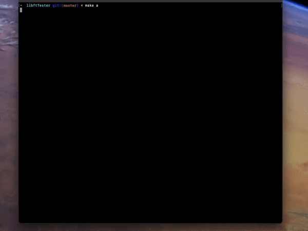

# 42libft

## A functions library written in C




Contains a lot of general purpose functions that our following programs will rely upon.
This was our first project in **Hive Helsinki**.
The library has been heavily unit tested by my own and fellow students' tests and online testers. The particular one above in the gif can be found ***[here](https://github.com/Tripouille/libftTester)***!

I actually completed this task in late **2022**, but I wanted to redo the commit history and make some minor changes.

## 📖 Topics
  - Memory management
  - String manipulation
  - Data structures
  - Code modularity
  - Unit testing

## 🛠️ Langs/Tools
  - C
  - Makefile

## 🦉 Getting started

If you want, for whatever reason, you can create the library file by:

  1. ```git clone https://github.com/kenlies/42libft```
  2. ```cd 42libft```
  3. ```make``` **or** ```make bonus``` for the bonus section

## 💸 Bonus section

The bonus part dove into the realm of linked lists, and how to create, delete, traverse and manipulate them.
This section was definitely worth doing. I think this helped me a lot throughout my studies.

## 🔨 To improve

Improvements on code modularity can be made. Also more unit testing is never a bad idea. Some variable names could be improved upon.
